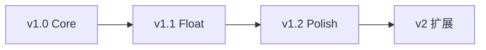
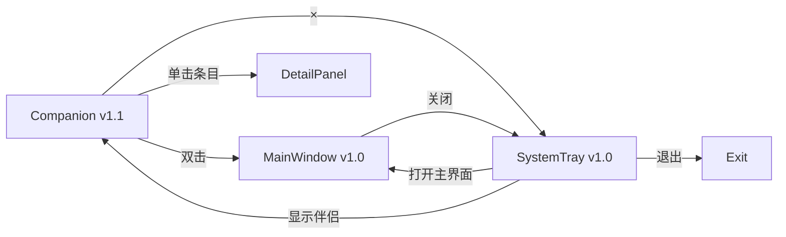

# 产品需求

> 回答 **做什么（WHAT）**。技术实现见 [技术设计.md](技术设计.md)。进度见 [项目进度.md](项目进度.md)。

---

## 1. 术语表

| 术语 | 说明 |
|------|------|
| repeat_type `none` | 一次性提醒，触发后 disabled（不混用 once） |
| repeat_type `daily` / `weekly` | 周期提醒（v1.2） |
| restore_todo | 清除软删除标记 deleted_at，status 不变 |
| transition_todo | 状态流转，如 Done → Todo |
| 软删除 | 设置 deleted_at，列表默认不可见 |
| Snooze | 通知后延迟再次提醒（v1.2） |

---

## 2. 目标用户

**个人用户**：需要在桌面长期驻留一款轻量任务助手，快速记录待办、查看优先级、接收提醒。

典型特征：

- 同时处理多类任务（工作、学习、生活）
- 希望任务入口始终可见（v1.1 桌面伴侣：圆球 / 面板 / 贴边条）
- 需要完整管理能力（筛选、排序、标签）
- 接受本地存储，暂不需要多设备同步

---

## 3. 产品分期

原 v1 Must 范围过大，拆分为三个子版本顺序交付：

### 3.1 v1.0 Core — 首版可发布

**目标**：验证「本地任务管理 + 提醒 + 托盘驻留」。

| 模块 | 范围 |
|------|------|
| UI | 主窗口（列表+详情）+ 系统托盘 |
| CRUD | 创建/编辑/软删/列表/搜索 |
| 状态 | Todo / Done 两态 |
| 提醒 | repeat_type=none + 系统通知 |
| 数据 | todos + reminders + settings |

**启动行为**：打开主窗口（或托盘图标唤起）。

### 3.2 v1.1 Float — 悬浮窗体验

| 模块 | 范围 |
|------|------|
| UI | 伴侣双窗（chrome 圆球/贴边条 + body 面板）与就地详情 |
| 状态 | Doing / Archived 四态状态机 |
| 字段 | due_date（可选截止日期） |
| 运行 | 启动默认显示伴侣；按默认形态与上次停放恢复 |

### 3.3 v1.2 Polish — 完整管理器

| 模块 | 范围 |
|------|------|
| 标签 | 标签编辑 + 筛选 |
| 提醒 | Snooze + daily/weekly |
| 审计 | events 表 |
| 系统 | 开机自启、托盘 badge、完整设置页 |

### 3.4 v1.3 Workbench — 主窗今日工作台

| 模块 | 范围 |
|------|------|
| UI | 三栏：智能视图 + 列表 + 常驻 Inspector（取代筛选侧栏与抽屉） |
| 默认 | 打开主窗落在「今日」；伴侣仍为日常捕获入口 |
| 深度 | 归档 / 回收站恢复、标签 chips、排序、状态动词、提醒改期、autosave |

### 3.5 v2 — 扩展（不做）

见本文档 **附录 A**。

---

## 4. User Story

| 编号 | 场景 | 作为用户，我希望… | 版本 |
|------|------|-------------------|------|
| US-01 | 快速添加任务 | 在主窗口或伴侣面板快速创建任务，只填标题即可保存 | v1.0 / v1.1 |
| US-02 | 今日工作台 | 打开主窗默认看今日；可切换逾期/进行中/全部等视图 | v1.3 |
| US-03 | 查看与编辑详情 | 在右侧 Inspector 编辑；字段自动保存 | v1.0 / v1.3 |
| US-04 | 定时提醒 | 为任务设置提醒时间，到点收到系统通知 | v1.0 |
| US-05 | 状态流转 | 用开始/完成/归档/重开等动词切换状态 | v1.0 两态；v1.1 四态；v1.3 动词 |
| US-06 | 标签分类 | 为任务添加标签，并按标签视图筛选 | v1.2 / v1.3 |
| US-07 | 托盘驻留 | 关闭窗口后最小化到托盘 | v1.0 |
| US-08 | 延迟提醒 | 收到通知后选择 Snooze | v1.2 |
| US-09 | 周期提醒 | 设置每日/每周重复提醒 | v1.2 |
| US-10 | 搜索任务 | 按关键字搜索任务标题和描述 | v1.0 |
| US-11 | 恢复任务 | 将 Done 重开为 Todo；回收站恢复软删 | v1.0 / v1.3 |
| US-12 | 伴侣配置 | 配置置顶、条数、默认形态、可选悬停预览 | v1.1 |
| US-13 | 伴侣与主窗分工 | 伴侣捕获/一眼；主窗深度工作台 | v1.3 |

> US-01 暂不包含全局快捷键（开放问题，见 §9）。

---

## 5. 功能需求

### 5.1 TODO 管理

| 字段 | 类型 | 规则 | 版本 |
|------|------|------|------|
| id | UUID | 系统自动生成 | v1.0 |
| title | string | 必填，1–200 字符 | v1.0 |
| description | string | 可选，纯文本，最大 5000 字符 | v1.0 |
| status | enum | 默认 Todo；v1.0 仅 Todo/Done | v1.0 / v1.1 |
| priority | enum | Low / Medium / High / Urgent，默认 Medium | v1.0 |
| tags | string[] | 最多 10 个，每个 1–30 字符 | v1.2 |
| due_date | datetime | 可选截止日期 | v1.1 |
| created_at / updated_at | datetime | 自动维护 | v1.0 |
| completed_at | datetime | status → Done 时写入 | v1.0 |
| deleted_at | datetime | 软删除 | v1.0 |

**边界**：删除采用软删除；列表默认排除 deleted 和 Archived；v1 不做物理删除。软删会禁用该任务提醒；回收站恢复后按规则重开（未过期提醒恢复；过期一次性不再响；过期周期跳到下一槽）。

### 5.2 状态管理

- v1.0：Todo ↔ Done
- v1.1：启用 Doing / Archived 四态，流转规则见 [技术设计.md §3](技术设计.md#3-状态机)

### 5.3 优先级

四级优先级，默认排序 priority DESC, created_at DESC。

### 5.4 查询与筛选

| 参数 | 说明 | 版本 |
|------|------|------|
| status / priority | 多选 | v1.0 |
| keyword | 模糊匹配 title/description | v1.0 |
| tags | AND 匹配 | v1.2 |
| due_date | 按截止日期筛选 | v1.1 |
| sort_by | priority / created_at / updated_at / completed_at / due_date | v1.0 / v1.1 |
| page / page_size | 默认 50，最大 200 | v1.0 |

### 5.5 定时提醒

- 独立实体，每任务最多 5 条
- repeat_type：`none`（v1.0）、`daily` / `weekly`（v1.2）
- none 触发后 enabled=false
- Snooze：5/15/30/60 分钟，最多 3 次（v1.2）

### 5.6 系统通知

Reminder 触发时发送原生通知：

- **title**：任务标题（非固定「提醒」）
- **body**：`Only Todo · 提醒 · {时间}`
- 点击 toast 或切回主窗口 → 唤起主窗口并在列表中定位对应任务

### 5.7 应用运行模式

| 行为 | v1.0 | v1.1 |
|------|------|------|
| 启动 | 显示主窗口 | 显示伴侣 |
| 关闭窗口 | 隐藏至托盘，非退出 | 同左 |
| 退出 | 仅托盘菜单「退出」 | 同左 |
| 开机自启 | — | v1.2 |

**边界**：单进程锁（`tauri-plugin-single-instance`）；二次启动聚焦已有主窗，不支持多实例。

### 5.8 事件审计

v1.2 启用 events 表。v1.0/v1.1 不写 events。

---

## 6. 交互与 UI 规格

### 6.1 整体结构

### 6.2 主窗口（v1.3 今日工作台）

伴侣负责捕获与一眼；主窗是深度工作台。启动仍默认出伴侣；主窗由托盘、伴侣双击、通知唤起。

**布局（三栏）**

- **左侧视图**：今日（默认）/ 逾期 / 进行中 / 全部 / 已完成 / 归档 / 回收站 / 标签…
- **中部列表**：勾选完成、逾期色、标签 chips、排序、分页或加载更多；空态带 CTA
- **右侧 Inspector**：常驻编辑栏（非抽屉）。选中打开；Esc 或再点同行关闭。字段 **自动保存**；删除需确认
- **顶栏**：品牌、全局搜索、新建、设置（可打开伴侣）

**状态**：Inspector 露出合法动词（开始 / 完成 / 归档 / 重开等），禁止无效四按钮乱点。

**新建**：轻量创建（标题必填，可选 due/优先级/标签）→ 留在当前视图并选中进 Inspector。日常快加仍以伴侣为主。

**回收站**：列出软删任务，可恢复（`restore_todo`）。

### 6.3 桌面伴侣（v1.1）

双窗：`float-chrome`（圆球或贴边条）与 `float-body`（任务面板）互斥显示。设置「默认形态」为家（`ball` 或 `panel`）。贴边是两种家都可进入的停放。

**圆球家**

- 自由停放：64×64 气泡（计数、逾期色）。无 − / ×；单击从球外推出临时面板（尺寸用上次面板 w/h，位置从球外推，不飞回旧坐标）；可拖、可贴边。四角透明不挡桌面。隐藏走托盘。
- 临时面板：− 回圆球；× 进托盘，再显示回圆球。顶栏快加（标题 Enter 即建，默认 Medium）。列表可勾选完成；单击条目就地详情；双击打开主窗定位。打开时焦点在快加（预览升级钉住不抢焦点）。顶栏拖动（约 10px 阈值）。

**面板家**

- 只显示面板，无圆球。− 收成贴边条（已贴过用上次边，否则更近一侧，Y 对齐面板中心）。× 进托盘。快加/列表/详情同上。

**贴边条**

- 工作区左或右。HWND 可能宽于 16px（WebView2 下限），外缘 **16×48** 胶囊条（逾期红 / 有待办蓝 + 内侧计数徽章），其余透明**点击穿透**不挡操作。面板按视觉 16px 让位，与加宽 HWND 重叠。单击钉住打开面板。再点条 / Esc / −：收回条（− 文案「收成条」）。× 进托盘。拖条改 Y / 换边 / 拖离；拖**面板**只改 Y，不 undock。
- 贴边条拖离：看 **chrome 实际外框**，阈值 `max(24px, chrome 宽 + 8)`。两侧都远则在松手中心回默认形态。
- 可选「悬停预览」默认关。仅实色条命中触发；约 400ms 预览、离开约 300ms 收；预览有「点击钉住」提示，单击升级钉住且不抢快加焦点。
- Esc：先关详情；贴边收条；圆球家临时板回球。面板家自由态 Esc 不进托盘（× 才进托盘）。托盘「显示伴侣」若已可见则保持当前钉住/临时板，不重置。

拖圆球/面板近左右缘（≤ 24px）松手成条。托盘左键切换整份伴侣显隐。再显示：已贴边只出条；否则出家（球或面板）。临时面板开着时藏起不写入停放坐标（只记面板 w/h）。

设置「默认形态」：未贴边且改了家才立即切到新家（球→面板时若临时板开着则提交当前位置为面板家）；已贴边只更新家，不改条/预览/钉住。关掉悬停只收 Preview，Pinned 不动。置顶/条数/启动显示不改变当前形态。

禁止：同一窗口在 64 / 320 / 16 间装列表变形；悬停作为默认展开；取消贴边瞬移到上次面板坐标；圆球上塞 −/×。

### 6.4 详情面板

| 表面 | 形态 | 字段 |
|------|------|------|
| 主窗 Inspector | 常驻右侧，autosave | 标题/描述/优先级/due/标签/提醒/状态动词/删除 |
| 伴侣 FloatDetail | 就地轻量 | 标题/描述/优先级/due/提醒/状态（无标签、无回收站） |

### 6.5 系统托盘

菜单：显示伴侣（v1.1）/ 打开主窗口 / 新建任务 / 设置 / 退出

- v1.0 左键单击：打开主窗口
- v1.1 左键单击：切换整份伴侣显示/隐藏

### 6.6 设置页

| 设置项 | 版本 |
|--------|------|
| 通知开关 / 默认排序 | v1.0 |
| 伴侣置顶 / 显示条数 / 默认形态（ball \| panel） / 可选悬停预览 | v1.1 |
| 开机自启 | v1.2 |

---

## 7. 验收标准

格式：Given - When - Then。Must 项阻塞发布。

### 7.1 v1.0

| 编号 | 场景 |
|------|------|
| AC-01 | 主窗口点击「+」创建任务，status=Todo |
| AC-05 | 按 status 筛选列表 |
| AC-07 | 关键字搜索 title |
| AC-10 | 编辑任务，updated_at 更新 |
| AC-11 | 软删除后列表不可见 |
| AC-12 | Todo → Done，completed_at 写入 |
| AC-14 | Done → Todo，completed_at 清空 |
| AC-15 | 创建 repeat_type=none 提醒 |
| AC-16 | 到期触发通知，enabled=false |
| AC-21 | 关闭主窗口，托盘驻留 |
| AC-23 | 托盘退出，进程结束 |
| AC-26 | 冷启动 2 秒内主窗口可见 |
| AC-28 | 1000 条任务 list P95 < 200ms |

### 7.2 v1.1

| 编号 | 场景 |
|------|------|
| AC-02 | 伴侣面板展示 N 条，按 priority 排序 |
| AC-03 | 单击伴侣条目展开详情（不含 tags） |
| AC-04 | 双击打开主窗口并定位 |
| AC-F01 | 圆球家显示气泡与计数；单击从球外推出临时面板 |
| AC-F02 | 临时面板 − 回球；× 进托盘且再显示回球 |
| AC-F03 | 球/面板拖近缘成条；贴边后近缘看 chrome 实际宽；近对侧换边 |
| AC-F04 | 贴边单击钉住；预览单击钉住；可选悬停；取消贴边在松手中心回 home |
| AC-F05 | 面板家无圆球；− 收条；× 进托盘；重启按 placement/home |
| AC-F06 | 有逾期任务时圆球高亮 |
| AC-13 | Archived → Done 返回 INVALID_TRANSITION |

### 7.4 v1.3

| 编号 | 场景 |
|------|------|
| AC-W01 | 打开主窗默认「今日」视图 |
| AC-W02 | 选中任务打开右侧 Inspector；字段自动保存 |
| AC-W03 | 回收站可恢复软删任务；归档仅在归档视图 |
| AC-W04 | 伴侣双击仍打开主窗并定位到 Inspector |
| AC-W05 | 列表勾选完成；逾期行高亮 |

---

## 8. 交付清单

### v1.0 Core

- [x] Tauri 2 脚手架 + Rust 分层架构
- [x] SQLite Schema（todos / reminders / settings）
- [x] TODO CRUD + list 筛选排序分页
- [x] Todo/Done 状态 + 软删除
- [x] Reminder none + Scheduler + 系统通知
- [x] 主窗口 UI + 详情面板
- [x] 系统托盘 + 后台常驻

### v1.1 Float

- [x] 伴侣双窗 UI + 就地详情
- [x] 四态状态机 + due_date
- [x] 停放记忆 + 启动默认伴侣

### v1.2 Polish

- [x] 标签 + 筛选 + Snooze + daily/weekly
- [x] events 审计 + 开机自启 + 托盘 badge

### v1.3 Workbench

- [x] 主窗三栏今日工作台 + Inspector autosave
- [x] 归档 / 回收站 / 标签 chips / 排序 / 状态动词
- [x] 应用内快捷键 `/ n j k Esc x`；空态 CTA；伴侣详情共用状态动词

### 明确不做

多设备同步、AI、插件、团队协作、看板、数据导入导出、主题/多语言。

---

## 9. 开放问题

- 全局快捷键 vs 应用内快捷键（v1.3 先做应用内）
- due_date 是否区分「全天」与「具体时刻」
- Windows / Linux 托盘 badge 实现差异

---

## 附录 A. v2 扩展方向

**不在 v1 范围。**

| 方向 | 说明 |
|------|------|
| 多设备同步 | SQLite → Sync Engine → Server/Git/WebDAV |
| AI 助手 | 任务拆解、总结、优先级建议、日程规划 |
| 自动化 | 完成任务 → 触发事件 → 执行脚本 |

