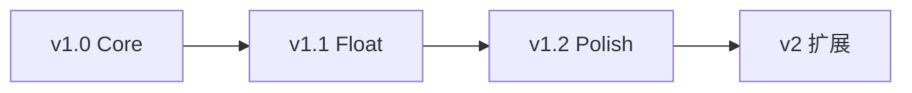
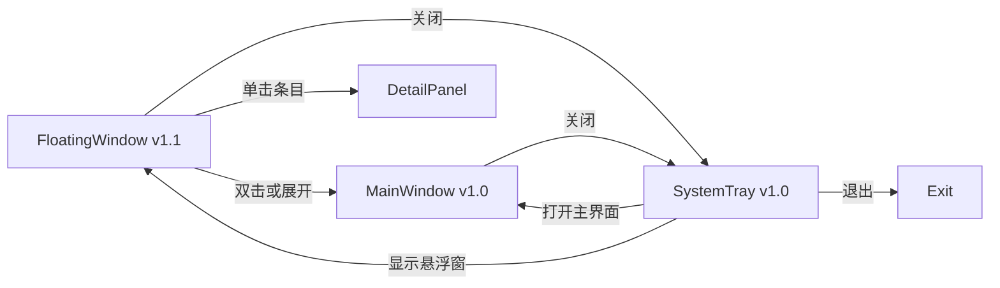

# 产品需求

> 回答 **做什么（WHAT）**。技术实现见 [技术设计.md](技术设计.md)。进度见 [项目进度.md](项目进度.md)。

---

## 1. 术语表

| 术语 | 说明 |
|------|------|
| repeat_type `none` | 一次性提醒，触发后 disabled（不混用 once） |
| repeat_type `daily` / `weekly` | 周期提醒（v1.2） |
| restore_todo | 清除软删除标记 deleted_at，status 不变 |
| transition_todo | 状态流转，如 Done → Todo |
| 软删除 | 设置 deleted_at，列表默认不可见 |
| Snooze | 通知后延迟再次提醒（v1.2） |

---

## 2. 目标用户

**个人用户**：需要在桌面长期驻留一款轻量任务助手，快速记录待办、查看优先级、接收提醒。

典型特征：

- 同时处理多类任务（工作、学习、生活）
- 希望任务入口始终可见（v1.1 悬浮窗）
- 需要完整管理能力（筛选、排序、标签）
- 接受本地存储，暂不需要多设备同步

---

## 3. 产品分期

原 v1 Must 范围过大，拆分为三个子版本顺序交付：

### 3.1 v1.0 Core — 首版可发布

**目标**：验证「本地任务管理 + 提醒 + 托盘驻留」。

| 模块 | 范围 |
|------|------|
| UI | 主窗口（列表+详情）+ 系统托盘 |
| CRUD | 创建/编辑/软删/列表/搜索 |
| 状态 | Todo / Done 两态 |
| 提醒 | repeat_type=none + 系统通知 |
| 数据 | todos + reminders + settings |

**启动行为**：打开主窗口（或托盘图标唤起）。

### 3.2 v1.1 Float — 悬浮窗体验

| 模块 | 范围 |
|------|------|
| UI | FloatingWindow + DetailPanel 就地展开 |
| 状态 | Doing / Archived 四态状态机 |
| 字段 | due_date（可选截止日期） |
| 运行 | 启动默认显示悬浮窗；窗口位置记忆 |

### 3.3 v1.2 Polish — 完整管理器

| 模块 | 范围 |
|------|------|
| 标签 | 标签编辑 + 筛选 |
| 提醒 | Snooze + daily/weekly |
| 审计 | events 表 |
| 系统 | 开机自启、托盘 badge、完整设置页 |

### 3.4 v2 — 扩展（不做）

见本文档 **附录 A**。

---

## 4. User Story

| 编号 | 场景 | 作为用户，我希望… | 版本 |
|------|------|-------------------|------|
| US-01 | 快速添加任务 | 在主窗口或悬浮窗快速创建任务，只填标题即可保存 | v1.0 / v1.1 |
| US-02 | 查看待办列表 | 在主窗口查看任务列表，并按状态、优先级筛选排序 | v1.0 |
| US-03 | 查看与编辑详情 | 查看详情并编辑标题、描述、优先级等 | v1.0 |
| US-04 | 定时提醒 | 为任务设置提醒时间，到点收到系统通知 | v1.0 |
| US-05 | 状态流转 | 将任务在 Todo / Doing / Done / Archived 间切换 | v1.0 两态；v1.1 四态 |
| US-06 | 标签分类 | 为任务添加标签，并按标签筛选 | v1.2 |
| US-07 | 托盘驻留 | 关闭窗口后最小化到托盘 | v1.0 |
| US-08 | 延迟提醒 | 收到通知后选择 Snooze | v1.2 |
| US-09 | 周期提醒 | 设置每日/每周重复提醒 | v1.2 |
| US-10 | 搜索任务 | 按关键字搜索任务标题和描述 | v1.0 |
| US-11 | 恢复任务 | 将 Done 任务恢复为 Todo | v1.0 |
| US-12 | 悬浮窗配置 | 配置悬浮窗置顶、显示条数、位置记忆 | v1.1 |

> US-01 暂不包含全局快捷键（开放问题，见 §9）。

---

## 5. 功能需求

### 5.1 TODO 管理

| 字段 | 类型 | 规则 | 版本 |
|------|------|------|------|
| id | UUID | 系统自动生成 | v1.0 |
| title | string | 必填，1–200 字符 | v1.0 |
| description | string | 可选，纯文本，最大 5000 字符 | v1.0 |
| status | enum | 默认 Todo；v1.0 仅 Todo/Done | v1.0 / v1.1 |
| priority | enum | Low / Medium / High / Urgent，默认 Medium | v1.0 |
| tags | string[] | 最多 10 个，每个 1–30 字符 | v1.2 |
| due_date | datetime | 可选截止日期 | v1.1 |
| created_at / updated_at | datetime | 自动维护 | v1.0 |
| completed_at | datetime | status → Done 时写入 | v1.0 |
| deleted_at | datetime | 软删除 | v1.0 |

**边界**：删除采用软删除；列表默认排除 deleted 和 Archived；v1 不做物理删除。

### 5.2 状态管理

- v1.0：Todo ↔ Done
- v1.1：启用 Doing / Archived 四态，流转规则见 [技术设计.md §3](技术设计.md#3-状态机)

### 5.3 优先级

四级优先级，默认排序 priority DESC, created_at DESC。

### 5.4 查询与筛选

| 参数 | 说明 | 版本 |
|------|------|------|
| status / priority | 多选 | v1.0 |
| keyword | 模糊匹配 title/description | v1.0 |
| tags | AND 匹配 | v1.2 |
| due_date | 按截止日期筛选 | v1.1 |
| sort_by | priority / created_at / updated_at / completed_at / due_date | v1.0 / v1.1 |
| page / page_size | 默认 50，最大 200 | v1.0 |

### 5.5 定时提醒

- 独立实体，每任务最多 5 条
- repeat_type：`none`（v1.0）、`daily` / `weekly`（v1.2）
- none 触发后 enabled=false
- Snooze：5/15/30/60 分钟，最多 3 次（v1.2）

### 5.6 系统通知

Reminder 触发时发送原生通知：

- **title**：任务标题（非固定「提醒」）
- **body**：`Only Todo · 提醒 · {时间}`
- 点击 toast 或切回主窗口 → 唤起主窗口并在列表中定位对应任务

### 5.7 应用运行模式

| 行为 | v1.0 | v1.1 |
|------|------|------|
| 启动 | 显示主窗口 | 显示悬浮窗 |
| 关闭窗口 | 隐藏至托盘，非退出 | 同左 |
| 退出 | 仅托盘菜单「退出」 | 同左 |
| 开机自启 | — | v1.2 |

**边界**：单进程锁，不支持多实例。

### 5.8 事件审计

v1.2 启用 events 表。v1.0/v1.1 不写 events。

---

## 6. 交互与 UI 规格

### 6.1 整体结构

### 6.2 主窗口（v1.0）

- **顶栏**：筛选（展开/收起）、固定、搜索、新建、设置
- **左侧**：筛选侧栏（默认展开，140px，可收起/固定；状态 + 优先级；v1.1 加 due_date；v1.2 加标签）
- **中部**：任务列表 + 分页（全宽）
- **详情**：右侧抽屉 overlay（点击列表项打开；保存/取消/ESC/遮罩关闭）
- 关闭窗口（X）→ 隐藏至托盘

**新建任务**：顶栏「+ 新建」与托盘「新建任务」均打开 `CreateTodoModal`（非 prompt）。字段：标题（必填）、描述（可选）、优先级（默认 Medium）。

### 6.3 悬浮窗（v1.1）

- 常驻桌面，可拖拽，可置顶
- 展示待办数量 + 最近 N 条高优先级任务（默认 N=5）
- 单击条目 → 详情面板；双击 → 主窗口定位
- 「+」快速创建；关闭 → 隐藏至托盘

### 6.4 详情面板

v1.0 以**右侧抽屉**形式呈现（非常驻第三栏），点击列表项打开，保存/取消/ESC/遮罩关闭。

| 字段 | v1.0 | v1.1 | v1.2 |
|------|------|------|------|
| 标题 / 描述 / 优先级 | ✓ | ✓ | ✓ |
| 状态 | Todo/Done | 四态 | 四态 |
| due_date | — | ✓ | ✓ |
| 标签 | — | — | ✓ |
| 提醒列表 | ✓ | ✓ | ✓ |

### 6.5 系统托盘

菜单：显示悬浮窗（v1.1）/ 打开主窗口 / 新建任务 / 设置 / 退出

- v1.0 左键单击：打开主窗口
- v1.1 左键单击：切换悬浮窗显示/隐藏

### 6.6 设置页

| 设置项 | 版本 |
|--------|------|
| 通知开关 / 默认排序 | v1.0 |
| 悬浮窗置顶 / 显示条数 | v1.1 |
| 开机自启 | v1.2 |

---

## 7. 验收标准

格式：Given - When - Then。Must 项阻塞发布。

### 7.1 v1.0

| 编号 | 场景 |
|------|------|
| AC-01 | 主窗口点击「+」创建任务，status=Todo |
| AC-05 | 按 status 筛选列表 |
| AC-07 | 关键字搜索 title |
| AC-10 | 编辑任务，updated_at 更新 |
| AC-11 | 软删除后列表不可见 |
| AC-12 | Todo → Done，completed_at 写入 |
| AC-14 | Done → Todo，completed_at 清空 |
| AC-15 | 创建 repeat_type=none 提醒 |
| AC-16 | 到期触发通知，enabled=false |
| AC-21 | 关闭主窗口，托盘驻留 |
| AC-23 | 托盘退出，进程结束 |
| AC-26 | 冷启动 2 秒内主窗口可见 |
| AC-28 | 1000 条任务 list P95 < 200ms |

### 7.2 v1.1

| 编号 | 场景 |
|------|------|
| AC-02 | 悬浮窗展示 N 条，按 priority 排序 |
| AC-03 | 单击悬浮窗条目展开详情（不含 tags） |
| AC-04 | 双击打开主窗口并定位 |
| AC-13 | Archived → Done 返回 INVALID_TRANSITION |

### 7.3 v1.2

| 编号 | 场景 |
|------|------|
| AC-08 | 标签筛选 |
| AC-18/19 | Snooze 与上限 |
| AC-20 | daily 周期提醒 |
| AC-25 | 开机自启 |

---

## 8. 交付清单

### v1.0 Core

- [ ] Tauri 2 脚手架 + Rust 分层架构
- [ ] SQLite Schema（todos / reminders / settings）
- [ ] TODO CRUD + list 筛选排序分页
- [ ] Todo/Done 状态 + 软删除
- [ ] Reminder none + Scheduler + 系统通知
- [ ] 主窗口 UI + 详情面板
- [ ] 系统托盘 + 后台常驻

### v1.1 Float

- [ ] 悬浮窗 UI + DetailPanel
- [ ] 四态状态机 + due_date
- [ ] 窗口位置记忆 + 启动默认悬浮窗

### v1.2 Polish

- [ ] 标签 + 筛选 + Snooze + daily/weekly
- [ ] events 审计 + 开机自启 + 托盘 badge

### 明确不做

多设备同步、AI、插件、团队协作、看板、数据导入导出、主题/多语言。

---

## 9. 开放问题

- 全局快捷键 vs 应用内快捷键
- due_date 是否区分「全天」与「具体时刻」
- 软删任务是否提供回收站 UI（建议 v1.2）
- Windows / Linux 托盘 badge 实现差异

---

## 附录 A. v2 扩展方向

**不在 v1 范围。**

| 方向 | 说明 |
|------|------|
| 多设备同步 | SQLite → Sync Engine → Server/Git/WebDAV |
| AI 助手 | 任务拆解、总结、优先级建议、日程规划 |
| 自动化 | 完成任务 → 触发事件 → 执行脚本 |

