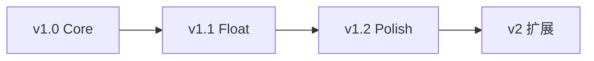
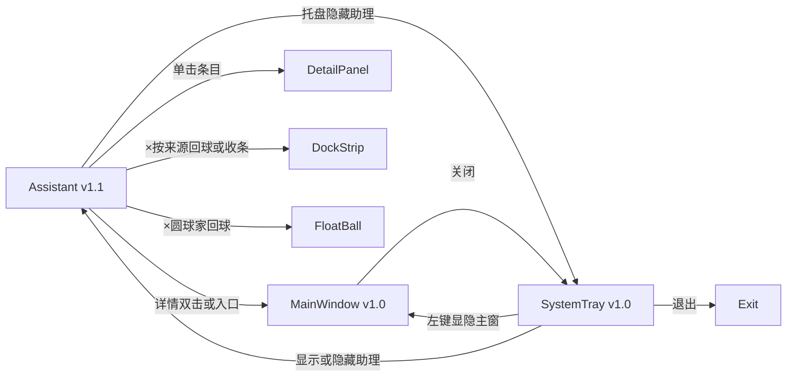

# 产品需求

> 回答 **做什么（WHAT）**。技术实现见 [技术设计.md](技术设计.md)。进度见 [项目进度.md](项目进度.md)。

---

## 1. 术语表

| 术语 | 说明 |
|------|------|
| repeat_type `none` | 一次性提醒，触发后 disabled（不混用 once） |
| repeat_type `daily` / `weekly` | 周期提醒（v1.2） |
| restore_todo | 清除软删除标记 deleted_at，status 不变 |
| transition_todo | 状态流转，如 Done → Todo |
| 软删除 | 设置 deleted_at，列表默认不可见 |
| Snooze | 通知后延迟再次提醒（v1.2） |

---

## 2. 目标用户

**个人用户**：需要在桌面长期驻留一款轻量任务助手，快速记录待办、查看优先级、接收提醒。

典型特征：

- 同时处理多类任务（工作、学习、生活）
- 希望任务入口始终可见（v1.1 桌面助理：圆球 / 面板 / 贴边条）
- 需要完整管理能力（筛选、排序、标签）
- 接受本地存储，暂不需要多设备同步

---

## 3. 产品分期

原 v1 Must 范围过大，拆分为三个子版本顺序交付：

### 3.1 v1.0 Core — 首版可发布

**目标**：验证「本地任务管理 + 提醒 + 托盘驻留」。

| 模块 | 范围 |
|------|------|
| UI | 主窗口（列表+详情）+ 系统托盘 |
| CRUD | 创建/编辑/软删/列表/搜索 |
| 状态 | Todo / Done 两态 |
| 提醒 | repeat_type=none + 系统通知 |
| 数据 | todos + reminders + settings |

**启动行为**：打开主窗口（或托盘图标唤起）。

### 3.2 v1.1 Float — 悬浮窗体验

| 模块 | 范围 |
|------|------|
| UI | 助理双窗（chrome 圆球/贴边条 + body 面板）与只读预览 |
| 状态 | Doing / Archived 四态状态机 |
| 字段 | due_date（可选截止日期） |
| 运行 | 启动默认显示助理；按默认形态与上次停放恢复 |

### 3.3 v1.2 Polish — 完整管理器

| 模块 | 范围 |
|------|------|
| 标签 | 标签编辑 + 筛选 |
| 提醒 | Snooze + daily/weekly |
| 审计 | events 表 |
| 系统 | 开机自启、托盘 badge、完整设置页 |

### 3.4 v1.3 Workbench — 主窗工作台

| 模块 | 范围 |
|------|------|
| UI | 单一列表壳：侧栏归类 + 扁平列表；选中后滑入 Inspector（非常驻空栏） |
| 默认 | 打开主窗落在「全部」（可改为已完成/归档/回收站）；助理仍为日常捕获入口 |
| 深度 | 归档 / 回收站恢复、标签、排序、状态动词、提醒改期、autosave |

### 3.5 v2 — 扩展（不做）

见本文档 **附录 A**。

---

## 4. User Story

| 编号 | 场景 | 作为用户，我希望… | 版本 |
|------|------|-------------------|------|
| US-01 | 快速添加任务 | 在主窗口或助理面板快速创建任务，只填标题即可保存 | v1.0 / v1.1 |
| US-02 | 主窗列表 | 打开主窗看到全部待办（含无截止日期）；侧栏切换已完成/标签/归档/回收站 | v1.3 |
| US-03 | 查看与编辑详情 | 选中任务后右侧 Inspector 编辑；字段自动保存 | v1.0 / v1.3 |
| US-04 | 定时提醒 | 为任务设置提醒时间，到点收到系统通知 | v1.0 |
| US-05 | 状态流转 | 用开始/完成/归档/重开等动词切换状态 | v1.0 两态；v1.1 四态；v1.3 动词 |
| US-06 | 标签分类 | 为任务添加标签，并按标签视图筛选 | v1.2 / v1.3 |
| US-07 | 托盘驻留 | 关闭窗口后最小化到托盘 | v1.0 |
| US-08 | 延迟提醒 | 收到通知后选择 Snooze | v1.2 |
| US-09 | 周期提醒 | 设置每日/每周重复提醒 | v1.2 |
| US-10 | 搜索任务 | 按关键字搜索全部未归档任务的标题和描述 | v1.0 |
| US-11 | 恢复任务 | 将 Done 重开为 Todo；回收站恢复软删 | v1.0 / v1.3 |
| US-12 | 助理配置 | 配置置顶、条数、默认形态、可选悬停预览 | v1.1 |
| US-13 | 助理与主窗分工 | 助理捕获/一眼；主窗侧栏归类与扁平列表 | v1.3 |
| US-14 | 时间语义 | 列表时间 token + Inspector 时间块（`timeMeta`）；不提供独立规划面板 | v1.3 |

> US-01 暂不包含全局快捷键（开放问题，见 §9）。

---

## 5. 功能需求

### 5.1 TODO 管理

| 字段 | 类型 | 规则 | 版本 |
|------|------|------|------|
| id | UUID | 系统自动生成 | v1.0 |
| title | string | 必填，1–200 字符 | v1.0 |
| description | string | 可选，纯文本，最大 5000 字符 | v1.0 |
| status | enum | 默认 Todo；v1.0 仅 Todo/Done | v1.0 / v1.1 |
| priority | enum | Low / Medium / High / Urgent，默认 Medium | v1.0 |
| tags | string[] | 最多 10 个，每个 1–30 字符 | v1.2 |
| due_date | datetime | 可选截止日期 | v1.1 |
| created_at / updated_at | datetime | 自动维护 | v1.0 |
| completed_at | datetime | status → Done 时写入 | v1.0 |
| deleted_at | datetime | 软删除 | v1.0 |

**边界**：删除采用软删除；列表默认排除 deleted 和 Archived；v1 不做物理删除。软删会禁用该任务提醒；回收站恢复后按规则重开（未过期提醒恢复；过期一次性不再响；过期周期跳到下一槽）。

### 5.2 状态管理

- v1.0：Todo ↔ Done
- v1.1：启用 Doing / Archived 四态，流转规则见 [技术设计.md §3](技术设计.md#3-状态机)

### 5.3 优先级

四级优先级，默认排序 priority DESC, created_at DESC。

### 5.4 查询与筛选

| 参数 | 说明 | 版本 |
|------|------|------|
| status / priority | 多选 | v1.0 |
| keyword | 模糊匹配 title/description | v1.0 |
| tags | AND 匹配 | v1.2 |
| due_date | 按截止日期筛选 | v1.1 |
| sort_by | priority / created_at / updated_at / completed_at / due_date | v1.0 / v1.1 |
| page / page_size | 默认 50，最大 200 | v1.0 |

### 5.5 定时提醒

- 独立实体，每任务最多 5 条
- repeat_type：`none`（v1.0）、`daily` / `weekly`（v1.2）
- none 触发后 enabled=false
- Snooze：5/15/30/60 分钟，最多 3 次（v1.2）

### 5.6 系统通知

Reminder 触发时发送原生通知：

- **title**：任务标题（非固定「提醒」）
- **body**：`Only Todo · 提醒 · {时间}`
- 点击 toast 或切回主窗口 → 唤起主窗口并在列表中定位对应任务

### 5.7 应用运行模式

| 行为 | v1.0 | v1.1 |
|------|------|------|
| 启动 | 显示主窗口 | 显示助理 |
| 关闭窗口 | 隐藏至托盘，非退出 | 同左 |
| 退出 | 仅托盘菜单「退出」 | 同左 |
| 开机自启 | — | v1.2 |

**边界**：单进程锁（`tauri-plugin-single-instance`）；二次启动聚焦已有主窗，不支持多实例。

### 5.8 事件审计

v1.2 启用 events 表。v1.0/v1.1 不写 events。

---

## 6. 交互与 UI 规格

### 6.1 整体结构

### 6.2 主窗口（工作台）

助理负责捕获与一眼；主窗回答「现在做什么」。启动仍默认出助理；主窗由托盘、助理详情双击/入口、通知、单实例二次启动唤起。隐藏助理走托盘菜单。

**主窗优先（与助理钉住面板）**：唤出主窗时，若助理处于钉住任务面板（或贴边悬停 Preview），先**形态退化**再聚焦主窗——圆球家临时板回球、贴边收成条、面板家自由态收成贴边条（与 × 同语义）。仅圆球 / 仅贴边条可与主窗同屏。主窗已在场时再打开助理钉住面板 → **两者同屏**（不隐藏主窗）。收起面板或隐藏助理不自动弹出主窗。贴边退化后抑制悬停 Preview（约 500ms 或指针离开条解除抑制）；抑制期内及指针未离开再进入前不自动 Preview，避免回弹闪烁。

**单一列表壳**

- **侧栏**（非搜索时）：全部 / 已完成 / 标签 / 归档 / 回收站。进行中不以顶层文件夹出现，而以行内芯片表达。
- **默认「全部」**：展示全部 Todo/Doing（含无截止日期的任务）。超过 `pageSize`（50）出现分页——这是预期行为。原焦点台只露出逾期/进行中/今日到期；剥离后无 due 的待办一并进入「全部」。
- **不提供**「今天 | 库」双模式，也不再有逾期 / 进行中 / 今日到期三段分组。

**布局**

- **顶栏**：跨库搜索（Enter 提交，可清除）、新建、设置；无品牌字（窗口标题承担）。
- **列表**：勾选完成；优先级仅色条；行 meta 仅在有截止日期时展示时间 token（今天/明天/逾期 N 天）；逾期着色；无 dueDate 的任务不展示年龄/未更新类时间信息。标签最多 2 个 +N（# pill 元数据）。
- **Inspector**：选中后从右侧滑入（约 320px），Esc / 再点同行收起。字段 **自动保存**（idle 不提示）；含**时间块**（创建/更新/截止/完成，逾期由截止行自然表达，不单独成行）。删除需应用内确认。提醒添加表单默认折叠。
- **底栏最近活动**：非搜索时展示；默认收起为一行摘要。无事件不展示。行不可点。搜索时隐藏侧栏与活动条（清除搜索后恢复）。
- **桌面壳**：表单下拉与日期时间为应用内控件；右键为应用内菜单（剪切/复制/粘贴/全选），禁用浏览器默认菜单
- **应用内 Message**：列表/创建/设置/Inspector/提醒/助理/检查更新等操作与校验失败，用顶中堆叠 Message（error 默认可关常驻；同场景 key 替换；成功重试或关弹窗后清除）。Modal 打开时 Message 仍叠在其上可见。**不**用 Message：需用户抉择的 Confirm、Inspector autosave 状态文案、更新进度 Modal、空态/companion 引导、以及系统通知。
- **系统通知 toast**（§5.6）：Reminder 到期由 OS 原生通知弹出；与应用内 Message 无关；点击可唤起主窗并定位任务。
- **模态关闭**：新建任务、设置点遮罩不关，只允许取消 / × / Esc；有未保存改动时 Esc / × / 取消先应用内确认。确认对话框点遮罩等价取消。下拉、日期、右键菜单仍点外面关闭。

**状态**：Inspector 露出合法动词（开始 / 完成 / 归档 / 重开等），禁止无效四按钮乱点。进行中以行内芯片表达。

**新建**：顶栏「新建」、快捷键 `n`、托盘「新建任务」、空态 CTA 打开创建弹窗（默认强调标题；「更多选项」展开描述/优先级/截止/标签）。当前在某标签页且未搜索时，标签字段预填该 tag（可改）。创建前 flush Inspector 未保存内容；成功后选中新任务并打开 Inspector。点遮罩不关闭弹窗；有草稿时 Esc / × / 取消先确认。日常快加仍以助理为主（助理快加可不设 due）。

**搜索**：`/` 聚焦搜索框；Enter 在全部 Todo/Doing/Done 中查找（不含归档/回收站），结果覆盖当前列表；搜索时侧栏隐藏。

**回收站**：列出软删任务，可恢复（`restore_todo`）。

**设置「打开主窗时」**：出厂「全部」；可选已完成/归档/回收站。保存不切换当前页面。旧值 today/doing/overdue/tag 与非法值回落为全部。

### 6.3 桌面助理（v1.1）

双窗：`float-chrome`（圆球或贴边条）与 `float-body`（任务面板）互斥显示。设置「默认形态」为家（`ball` 或 `panel`）。贴边是两种家都可进入的停放。

**圆球家**

- 自由停放：64×64 仪表圆球（空闲淡 accent 环 + 中心点；有待办实色环 + 右上角标计数；逾期红环轻呼吸；无外扩阴影）。无 − / ×；单击从球外推出临时面板（尺寸用上次面板 w/h，位置从球外推，不飞回旧坐标）；可拖、可贴边。四角透明不挡桌面。隐藏走托盘。
- 临时面板：× / Esc 收回圆球（不进托盘）。顶栏快加（标题 Enter 即建，默认 Medium）与「打开主窗口」入口。列表按设置条数展示（出厂 10）；超出时底栏提示「还有 N 条」并可打开主窗查看（不带当前预览定位）。列表可勾选完成；单击条目即时行内展开只读预览（标题/描述）；预览双击或顶栏入口定位主窗。打开时焦点在快加（预览升级钉住不抢焦点）。顶栏拖动（约 10px 阈值）。

**面板家**

- 只显示面板，无圆球。× 收成贴边条（已贴过用上次边，否则更近一侧，Y 对齐面板中心）。快加/列表/详情同上。

**贴边条**

- 工作区左或右。HWND 可能宽于 16px（WebView2 下限），外缘 **16×48** 表面手柄（空闲淡 accent 脊 + 竖点；有待办实色脊 + 内侧实色角标；逾期红脊轻呼吸；与圆球同色板、无外扩阴影）。其余透明**点击穿透**不挡操作。面板按视觉 16px 让位，与加宽 HWND 重叠。单击钉住打开面板。再点条 / Esc / ×：收回条。隐藏进托盘走托盘菜单。拖条改 Y / 换边 / 拖离；拖**面板**只改 Y，不 undock。
- 贴边条拖离：看 **chrome 实际外框**，阈值 `max(24px, chrome 宽 + 8)`。两侧都远则在松手中心回默认形态。
- 可选「悬停预览」默认关。仅实色条命中触发；约 400ms 预览、离开约 300ms 收；预览有「点击钉住」提示，单击升级钉住且不抢快加焦点。预览态快加已输入未提交时，失焦或指针离开不收起；清空草稿后仍按离开约 300ms 收。Esc / × 仍收起。
- Esc：先关详情；贴边收条；圆球家临时板回球。面板家自由态 Esc 不收条（× 才收条）。托盘「显示助理」若已可见则保持当前钉住/临时板，不重置。
- 主窗唤出导致的面板退化见 §6.2「主窗优先」；贴边退化后抑制悬停 Preview，须指针离开条再进入才重新 Preview（抑制旗约 500ms 或离开时清除）。

拖圆球/面板近左右缘（≤ 24px）松手成条。托盘菜单「显示助理 / 隐藏助理」（互斥一项）控制整份助理显隐；再显示：已贴边只出条；否则出家（球或面板）。临时面板开着时藏起不写入停放坐标（只记面板 w/h）。

设置「默认形态」：未贴边且改了家才立即切到新家（球→面板时若临时板开着则提交当前位置为面板家）；已贴边只更新家，不改条/预览/钉住。关掉悬停只收 Preview，Pinned 不动。置顶/条数/启动显示不改变当前形态。

禁止：同一窗口在 64 / 320 / 16 间装列表变形；悬停作为默认展开；取消贴边瞬移到上次面板坐标；圆球上塞 ×。

### 6.4 详情面板

| 表面 | 形态 | 字段 |
|------|------|------|
| 主窗 Inspector | 常驻右侧，autosave | 标题/描述/优先级/due/标签/提醒/状态动词/删除 |
| 助理 FloatDetail | 列表行内只读预览 | 标题 / 描述；双击进主窗（顶栏另有入口；不可编辑） |

### 6.5 系统托盘

菜单：**显示助理** 或 **隐藏助理**（互斥一项，随助理显隐切换文案）/ 新建任务 / 设置 / 退出（无「打开主窗口」）

- 左键单击托盘图标：在「主窗在场（含最小化）」与「已收入托盘」之间切换——在场则 `hide` 进托盘，已隐藏则唤出并聚焦；**显示主窗时会退化助理钉住面板**（球/条可留），隐藏主窗不改动助理
- 菜单项控制整份助理显隐；隐藏后「显示助理」再显示：已贴边只出条，否则出家

### 6.6 设置页

| 设置项 | 版本 |
|--------|------|
| 通知开关 / 默认排序 | v1.0 |
| 助理置顶 / 显示条数（出厂 10，可调 1–20） / 默认形态（ball \| panel） / 可选悬停预览 | v1.1 |
| 开机自启 | v1.2 |
| 主题（system \| light \| dark）/ 界面语言（zh-CN \| en-US） | v1.3+ |
| 当前版本 / 检查更新 | v1.4+ |

**应用内更新（v1.4+）**：

- 仅**主窗口**参与：启动约 3s 后自动检测；设置页可手动「检查更新」
- 发现新版本 → `AppConfirm` 展示版本与 Release notes → 用户点「立即更新」或「稍后」（稍后写入本地跳过记录，同版本不再自动弹）
- 非决策提示（已是最新、开发模式不可更新、flush 失败、检查失败）走应用内 Message，不弹单按钮 Confirm
- 确认后：先 flush Inspector 未保存内容 → 不可关闭的进度 Modal → 后台下载 → NSIS passive 安装 → **自动重启**到新版本（用户无需再点安装向导）
- 开发模式不检测；`0.1.0` 等首个 updater 之前版本用户需手动安装一次带 updater 的包

---

## 7. 验收标准

格式：Given - When - Then。Must 项阻塞发布。

### 7.1 v1.0

| 编号 | 场景 |
|------|------|
| AC-01 | 主窗口点击「+」创建任务，status=Todo |
| AC-01b | 新建/设置点遮罩不关；有未保存改动时 Esc/×/取消先确认；确认框点遮罩=取消 |
| AC-05 | 按 status 筛选列表 |
| AC-07 | 关键字搜索 title |
| AC-10 | 编辑任务，updated_at 更新 |
| AC-11 | 软删除后列表不可见 |
| AC-12 | Todo → Done，completed_at 写入 |
| AC-14 | Done → Todo，completed_at 清空 |
| AC-15 | 创建 repeat_type=none 提醒 |
| AC-16 | 到期触发通知，enabled=false |
| AC-21 | 关闭主窗口，托盘驻留 |
| AC-23 | 托盘退出，进程结束 |
| AC-26 | 冷启动 2 秒内主窗口可见 |
| AC-28 | 1000 条任务 list P95 < 200ms |

### 7.2 v1.1

| 编号 | 场景 |
|------|------|
| AC-02 | 助理面板展示 N 条（出厂 N=10），按 priority 排序；超出时底栏提示还有更多并可打开主窗 |
| AC-03 | 单击助理条目展开只读预览（标题/描述；不含编辑） |
| AC-04 | 详情双击或「打开主窗口」入口打开主窗并定位 |
| AC-F01 | 圆球家显示仪表环与角标计数；单击从球外推出临时面板 |
| AC-F02 | 临时面板 × / Esc 收回圆球（不进托盘） |
| AC-F03 | 球/面板拖近缘成条；贴边后近缘看 chrome 实际宽；近对侧换边；贴边单击钉住；可选悬停 |
| AC-F04 | 取消贴边在松手中心回 home；拖离阈值按 chrome 外框 |
| AC-F05 | 面板家无圆球；× 收条；重启按 placement/home |
| AC-F06 | 有逾期任务时圆球高亮 |
| AC-13 | Archived → Done 返回 INVALID_TRANSITION |

### 7.4 v1.3

| 编号 | 场景 |
|------|------|
| AC-W01 | 打开主窗默认「全部」（含无 due）；设置其它归类则进对应视图；保存不切换当前页 |
| AC-W02 | 选中任务后右侧滑入 Inspector；字段自动保存；无选中不占列 |
| AC-W03 | 回收站可恢复软删任务；归档仅在侧栏·归档 |
| AC-W04 | 助理详情双击 / 入口仍打开主窗并定位到 Inspector |
| AC-W05 | 列表勾选完成；逾期截止着色 |
| AC-W06 | 顶栏/ `n` / 托盘 / 空态打开新建弹窗；标签页预填当前 tag；创建后进 Inspector；`/` 搜索跨 Todo/Doing/Done；搜索时侧栏隐藏 |
| AC-W07 | 列表与 Inspector 时间语义一致（`timeMeta`：相对到期/创建）；无独立时间规划面板 |
| AC-W08 | 唤出主窗时钉住面板/贴边 Preview 形态退化（回球或留条）；主窗已在时再开钉住面板可同屏；贴边退化后不因指针停在条上立即回弹 Preview（须离开再进入） |

---

## 8. 交付清单

### v1.0 Core

- [x] Tauri 2 脚手架 + Rust 分层架构
- [x] SQLite Schema（todos / reminders / settings）
- [x] TODO CRUD + list 筛选排序分页
- [x] Todo/Done 状态 + 软删除
- [x] Reminder none + Scheduler + 系统通知
- [x] 主窗口 UI + 详情面板
- [x] 系统托盘 + 后台常驻

### v1.1 Float

- [x] 助理双窗 UI + 只读预览 / 快加 / 勾选完成
- [x] 四态状态机 + due_date
- [x] 停放记忆 + 启动默认助理

### v1.2 Polish

- [x] 标签 + 筛选 + Snooze + daily/weekly
- [x] events 审计 + 开机自启 + 托盘 badge

### v1.3 Workbench

- [x] 主窗单一列表壳（侧栏归类 + 扁平列表 + 按需 Inspector）+ autosave
- [x] 归档 / 回收站 / 标签 chips / 排序 / 状态动词
- [x] 应用内快捷键 `/ n j k Esc x`；顶栏新建弹窗；助理只读预览 + 详情双击/入口进主窗
- [x] 暗色主题（system/light/dark）+ 界面 i18n（zh-CN / en-US）

### 明确不做

多设备同步、AI、插件、团队协作、看板、数据导入导出。

---

## 9. 开放问题

- 全局快捷键 vs 应用内快捷键（v1.3 先做应用内）
- due_date 是否区分「全天」与「具体时刻」
- Windows / Linux 托盘 badge 实现差异

---

## 附录 A. v2 扩展方向

**不在 v1 范围。**

| 方向 | 说明 |
|------|------|
| 多设备同步 | SQLite → Sync Engine → Server/Git/WebDAV |
| AI 助手 | 任务拆解、总结、优先级建议、日程规划 |
| 自动化 | 完成任务 → 触发事件 → 执行脚本 |

