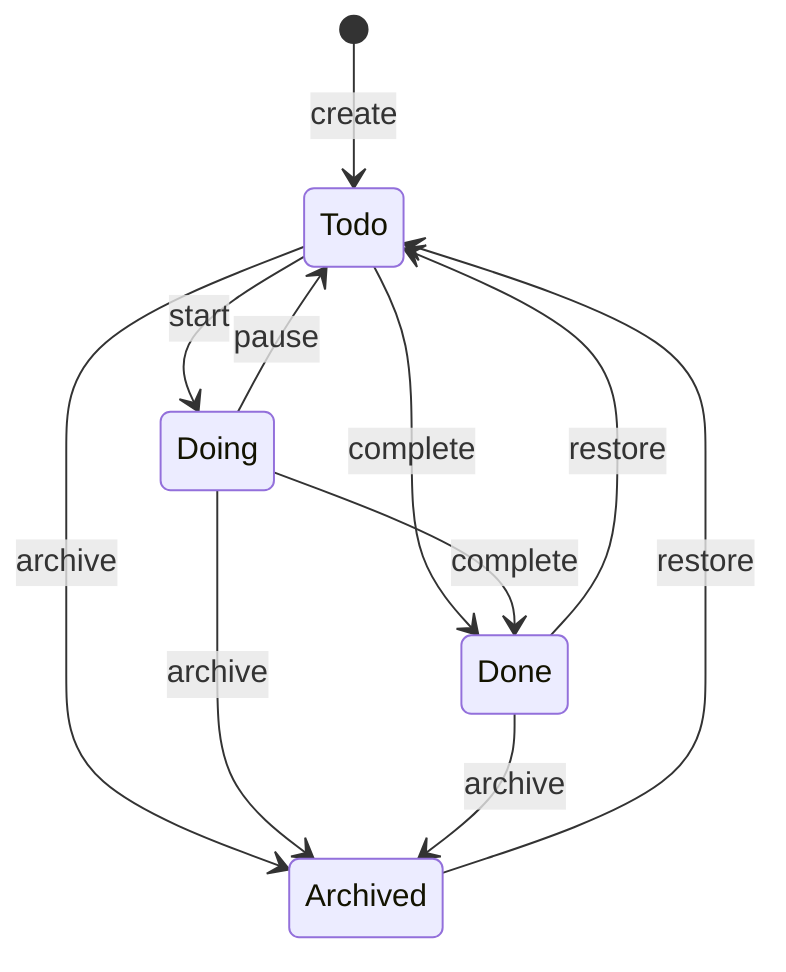
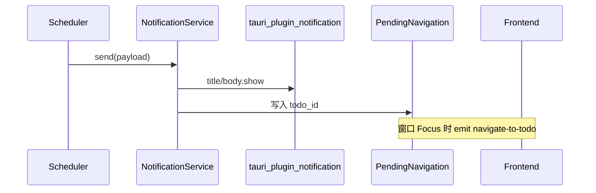
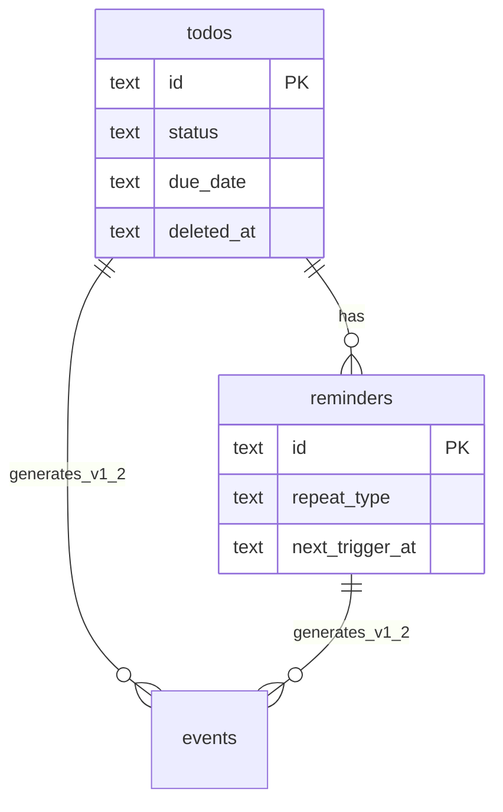

# 技术设计

> 回答 **怎么做（HOW）**。产品需求见 [产品需求.md](产品需求.md)。

---

## 1. 架构概览

### 1.1 技术栈

```
Desktop Framework: Tauri 2
Backend:           Rust
Frontend:          Vue 3
Database:          SQLite 3（WAL）
Runtime:           Tokio
```

### 1.2 分层结构

```
Frontend (Vue 3)
  ├── MainWindow       v1.0
  ├── FloatingWindow   v1.1
  └── SystemTray       v1.0
        |
Tauri Command
        |
Service Layer（校验 + 状态机）
        |
Repository Layer
        |
SQLite / System API（Notification）
        |
Scheduler（Tokio，tick=30s）
```

### 1.3 Rust 模块

```
src-tauri/src
├── commands        # Tauri 接口
├── domain          # Todo, Reminder, Status, CompanionSession
├── float           # FloatHost / session / persistence / window_ops / geometry / surfaces
├── services        # 业务逻辑
├── repository      # 数据访问
├── infrastructure
│   ├── database
│   ├── notification
│   └── filesystem
├── scheduler       # 后台提醒
├── events          # 审计写入 + list_events 读取
└── errors          # AppError
```

前端类型契约：`cargo run --bin export-ts`（或 `npm run gen:types` / `mise run gen-types`）从 Rust domain 生成 `src/api/generated/`；`src/api/types.ts` 再导出并补充 UI 常量。
### 1.4 调用流程

```
Frontend → Tauri Command → Service → Repository → SQLite → Result<T, AppError>
```

### 1.5 运行环境

| 层级 | 管理文件 | 说明 |
|------|----------|------|
| 工具链 | [mise.toml](../mise.toml) | Node 24、Rust stable |
| 前端依赖 | package.json + package-lock.json | Vue、Vite、@tauri-apps/cli |
| 后端依赖 / 插件 | Cargo.toml + Cargo.lock | tauri、tauri-plugin-notification、tauri-plugin-autostart、tauri-plugin-single-instance、rusqlite 等 |
| 安全 | tauri.conf.json CSP | `default-src 'self'` + ipc/asset；无 opener 插件 |

Tauri 插件（notification / autostart / single-instance）为 Cargo 依赖，由 `cargo build` 安装，不在 mise 中管理。

命令入口：

```bash
mise run install   # npm install
mise run dev       # 开发
mise run check     # cargo check
mise run build     # 构建
```

脚本或未激活 mise 的环境使用：`mise exec -- <command>`

### 1.6 前端目录结构

```
src/
├── api/           # Tauri invoke 封装 + generated/
├── composables/   # useTodos / useTodoDetail
├── components/
│   ├── common/
│   ├── float/     # 助理 chrome/body 组件
│   ├── workbench/ # ViewSidebar / TaskListPane / TaskInspector
│   ├── layout/    # AppHeader
│   ├── todo/      # CreateTodoModal 等共享
│   └── settings/
├── i18n/          # vue-i18n：zh-CN / en-US
├── styles/        # tokens.css（light/dark）+ forms.css
├── utils/         # appearance / theme / date / error …
├── FloatChromeApp.vue
├── FloatBodyApp.vue
└── App.vue        # 主窗今日工作台壳
```

**主窗 IA（v1.3）**：左视图导航 + 中列表 + 右 Inspector。`useTodos` 调用 `list_workbench_todos(ListWorkbenchQuery)`（视图语义在后端；回收站走 `view=trash`）。Inspector autosave（切选/Esc 前 flush；`saveStatus`：idle / dirty / saving / saved）；`get_todo` 含软删记录供回收站 Inspector，update/transition 仍拒软删。助理详情保持轻量壳；关详情 / 最小化 / 隐藏前若 dirty 则 flush。

**主题与语言**：settings `ui.theme`（`system` \| `light` \| `dark`）与 `ui.locale`（`zh-CN` \| `en-US`）。`main.ts` 在 mount 前 `getSettings` + `applyAppearance`；三窗另听 `settings-updated`。`data-theme`（system 解析 `prefers-color-scheme`）+ vue-i18n；语义色在 `src/styles/tokens.css`。状态动词按钮前端按 `target` 映射 `$t('statusAction.*')`（忽略后端中文 `label`）。托盘菜单/tooltip 文案随 `ui.locale`（`tray_i18n`，locale 变更时 `set_text`）。

路径别名：`@/` → `src/`（tsconfig paths + Vite resolve.alias）

多窗口：`main.ts` 按 `getCurrentWindow().label` 挂载 `App.vue` / `FloatChromeApp.vue` / `FloatBodyApp.vue`；共用同一 i18n 创建方式。

### 1.7 桌面助理（v1.1）

产品称「助理」；代码与 settings 仍用 `companion.*` / `CompanionSession` 等标识（不改存储键）。

[`tauri.conf.json`](../src-tauri/tauri.conf.json) 定义 `float-chrome` 与 `float-body`（frameless、transparent、alwaysOnTop）。Rust `FloatHost` 为唯一会话；前端只渲染。事件 `float-session-changed`。会话含派生 `chrome: ball | strip | hidden`。任务/提醒写成功另发 `todos-changed`，主窗与助理 refetch。监听时：列表先刷新；仅本地详情 **dirty** 时 `flushAutosave`，否则 `reload`——**不强制回写未改表单**，避免覆盖跨窗修改与 update 风暴。助理 `panelVisible` 变 false（含 Chrome Esc 收起）时同样 flush；flush 失败则不关详情。

| Command | 说明 |
|---------|------|
| show/hide/toggle_floating_window | 显示/隐藏/切换整份助理；贴边再显示只恢复条 |
| get_active_todo_count | Todo+Doing 计数（托盘 tooltip） |
| get_companion_session | 只读会话快照，不广播 |
| companion_refresh_session | 快照并 emit（如快加后刷新计数） |
| companion_click_chrome | 球→临时面板；条/预览→钉住切换 |
| companion_minimize | −：按矩阵回球或收条 |
| companion_drag_ended | 近缘吸附 / 贴边换边 / 拖离在松手处回 home；仍按下则 `{ stillDragging: true }` |
| companion_pointer_cluster | 可选悬停预览的指针与焦点 |
| companion_open_view | 扩展 BodyView（当前仅 todoMini） |

**会话**：`visibility` + `placement`（free \| docked）+ `home_shape`（ball \| panel）+ `panel_mode`（closed \| preview \| pinned）。不持久化 Preview 与临时面板开着。

**几何**：工作区 `work_area`。自由态近缘吸附仍 ≤ 24px。贴边**拖条**结束用 chrome outer，阈值 `max(24, chrome.width + 8)`：Stay / Switch / Undock。贴边**拖面板**只更新 `dock_y` 并让 chrome 跟随 Y，不 undock。点球出板：w/h 用上次面板（inner），x/y 写入 `temp_body_bounds`。条视觉 16×48，HWND 可更宽；透明区 `set_ignore_cursor_events` 轮询穿透；body 按视觉 16px 让位。拖离回球/面板家：松手中心对齐。程序化 apply 约 150ms `applying`。仅 `focus_body_once`（点条/点球）时 `set_focus`；AOT 仅在设置变化时重设。`show()` 已可见则幂等。拖拽 settle 100ms。

圆球 HWND **强制 64×64**（`ball_pos` 只记 x/y）。两窗 `shadow: false`。

**位置记忆**（migration 007，从 `floating_window.*` 迁移；008 补齐缺键）：

| settings key | 用途 |
|--------------|------|
| companion.home_shape | 默认形态 ball / panel |
| companion.placement | free / docked |
| companion.panel_bounds | 面板**家** xywh；圆球家只更新 w/h |
| companion.ball_pos | 圆球位置 |
| companion.dock_edge / dock_y / has_docked | 贴边 |
| companion.always_on_top / visible_count / auto_show | 置顶、条数、启动显示 |
| companion.hover_preview | 悬停预览，默认 false |

运行时 `RuntimeState.temp_body_bounds`：圆球家临时板本次位置。`−` / 隐藏 / 托盘再显示回球时清空。设置球→面板且临时板开着时提交进 `panel_bounds`。

自由态 + 面板家：body `Moved`/`Resized` 写满 `panel_bounds`。自由态 + 圆球家：更新 temp + 只持久化 w/h。圆球 chrome 写回 `ball_pos`。`settings-updated` 通知刷新条数；仅 `float_default_mode` 变更且未贴边才切 home；关悬停只把 Preview→Closed。

---

## 2. 非功能指标

| 指标 | 目标 | 测量方式 |
|------|------|----------|
| 冷启动 | < 2s | v1.0 主窗口可见；v1.1 助理可见 |
| 空闲内存 | 主窗 + 两助理 WebView 常驻，以实测为准 | 托盘驻留 30min 后采样 |
| 空闲 CPU | < 1% | 无提醒触发时 5min 均值 |
| 列表加载 | < 200ms | 1000 条 list_todos P95 |
| 数据安全 | 崩溃不丢数据 | WAL + 事务 |

日志路径：`{app_data_dir}/only-todo/logs/app.log`

---

## 3. 状态机

### 3.1 v1.0 两态（历史）

v1.1 起已启用四态，见 §3.2。

### 3.2 v1.1 四态



### 3.3 禁止流转（v1.1）

- Archived → Done / Doing
- Done → Doing（须 restore → Todo → start）
- 同状态 → 返回当前实体

### 3.4 命令语义

| 操作 | 命令 | 说明 |
|------|------|------|
| Done → Todo | transition_todo(id, Todo) | 清空 completed_at |
| 软删恢复 | restore_todo(id) | 清除 deleted_at，status 不变；重开软删时禁用的提醒（已过期一次性保持关闭；已过期周期跳到未来） |

合法流转 v1.2 写入 events：`todo.transitioned`，payload `{ from, to }`。

状态机单源：`domain/status.rs` 的 `can_transition_to` / `allowed_transitions`；前端经 `get_allowed_transitions` 拉取动词按钮。

---

## 4. 数据设计

### 4.1 存储

- Local First，路径 `{app_data_dir}/only-todo/data.db`
- Windows: `%APPDATA%/only-todo/data.db`
- macOS: `~/Library/Application Support/only-todo/data.db`
- Linux: `~/.local/share/only-todo/data.db`
- `PRAGMA journal_mode=WAL; foreign_keys=ON;`

### 4.2 todos 表

```sql
CREATE TABLE todos (
    id           TEXT PRIMARY KEY,
    title        TEXT NOT NULL,
    description  TEXT NOT NULL DEFAULT '',
    status       TEXT NOT NULL DEFAULT 'Todo'
                 CHECK (status IN ('Todo','Doing','Done','Archived')),
    priority     TEXT NOT NULL DEFAULT 'Medium'
                 CHECK (priority IN ('Low','Medium','High','Urgent')),
    tags         TEXT NOT NULL DEFAULT '[]',      -- v1.2 使用
    due_date     TEXT,                            -- v1.1 新增
    created_at   TEXT NOT NULL,
    updated_at   TEXT NOT NULL,
    completed_at TEXT,
    deleted_at   TEXT
);

CREATE INDEX idx_todos_status ON todos(status) WHERE deleted_at IS NULL;
CREATE INDEX idx_todos_priority ON todos(priority) WHERE deleted_at IS NULL;
CREATE INDEX idx_todos_created_at ON todos(created_at);
```

**分期**：v1.0 migration 不含 tags/due_date 列；v1.1 加 due_date；v1.2 启用 tags JSON；v1.3+ migration 009 规范化 `tags` + `todo_tags`（JSON 仍作快照，筛选走关联表）。启动时幂等 backfill；失败则 `tracing::error!` 并阻止启动，避免「有标签却筛不到」。

### 4.3 reminders 表

```sql
CREATE TABLE reminders (
    id              TEXT PRIMARY KEY,
    todo_id         TEXT NOT NULL REFERENCES todos(id) ON DELETE CASCADE,
    remind_at       TEXT NOT NULL,
    repeat_type     TEXT NOT NULL DEFAULT 'none'
                    CHECK (repeat_type IN ('none','daily','weekly')),
    repeat_config   TEXT NOT NULL DEFAULT '{}',
    snooze_count    INTEGER NOT NULL DEFAULT 0,
    next_trigger_at TEXT NOT NULL,
    enabled         INTEGER NOT NULL DEFAULT 1,
    created_at      TEXT NOT NULL,
    updated_at      TEXT NOT NULL
);

CREATE INDEX idx_reminders_next_trigger ON reminders(next_trigger_at) WHERE enabled = 1;
CREATE INDEX idx_reminders_todo_id ON reminders(todo_id);
```

repeat_config：

```json
// daily: {}
// weekly: { "weekdays": [1, 3, 5] }  // 0=周日
```

> 统一使用 `none` 表示一次性提醒，不使用 `once`。

### 4.4 settings 表

```sql
CREATE TABLE settings ( key TEXT PRIMARY KEY, value TEXT NOT NULL );
```

预置 key：companion.*、main_window.bounds、autostart.enabled、list.default_sort、notification.enabled、`ui.theme`（默认 system）、`ui.locale`（默认 zh-CN）

`update_settings`：先写 SQLite；仅当 `autostart.enabled` **相对当前值变化** 时再调 `tauri-plugin-autostart`。OS 同步失败（开发态路径、Windows 无启动项时报 os error 2 等）只打日志，**不回滚已保存偏好**、不阻断其它设置项。`ui.theme` / `ui.locale` 变更经 `settings-updated` 同步三窗外观。

### 4.5 events 表（v1.2）

```sql
CREATE TABLE events (
    id          TEXT PRIMARY KEY,
    entity_type TEXT NOT NULL CHECK (entity_type IN ('todo','reminder')),
    entity_id   TEXT NOT NULL,
    event_type  TEXT NOT NULL,
    payload     TEXT NOT NULL DEFAULT '{}',
    created_at  TEXT NOT NULL
);
```

### 4.6 schema_version

```sql
CREATE TABLE schema_version ( version INTEGER PRIMARY KEY, applied_at TEXT NOT NULL );
```

迁移策略：启动检查 version → 按序执行 `{version}_{description}.sql` → **与 `schema_version` 写入同一事务**，失败回滚并阻止启动。

### 4.7 完整性

- 软删任务不级联删 reminders，但 `enabled=0`；Scheduler 对 deleted todo 仅 advance 到未来、不通知
- `restore_todo` 调用 `ReminderRepository::reenable_after_restore`：未来触发时间的提醒重新 `enabled=1`；已过期周期推进到下一槽；已过期一次性保持关闭（避免恢复瞬间通知洪水）
- 写路径成功后 emit `todos-changed`（见 `broadcast::emit_todos_changed`），主窗/助理监听刷新列表与计数，并更新托盘 tooltip；主窗无 dirty 时不回写表单
- 通知 / 助理双击 `navigate-to-todo`：主窗按需切到 trash 或 all，再选中，保证列表露出该行
- 今日空态「添加今日任务」预填当日 due；全部等视图 CTA 为「添加任务」
- 提醒配额仅计 `enabled=1`；列表 due 筛选上界为半开区间 `< before`，与角标 count 一致

---

## 5. API 设计

### 5.1 通用类型

**AppError**

```json
{ "code": "VALIDATION_ERROR", "message": "...", "details": {} }
```

**PaginatedResponse**

```json
{ "items": [], "total": 0, "page": 1, "page_size": 50 }
```

### 5.2 Todo Commands

| Command | 签名 | 版本 |
|---------|------|------|
| create_todo | `(CreateTodoDto) -> TodoDto` | v1.0 |
| update_todo | `(UpdateTodoDto) -> TodoDto` | v1.0 |
| delete_todo | `(id) -> ()` 软删 | v1.0 |
| restore_todo | `(id) -> TodoDto` | v1.0 |
| get_todo | `(id) -> TodoDto`（含软删，供回收站 Inspector） | v1.0 / v1.3 |
| list_todos | `(ListTodoQuery) -> PaginatedResponse<TodoDto>` | v1.0 |
| list_workbench_todos | `(ListWorkbenchQuery) -> PaginatedResponse<TodoDto>` | v1.3+ |
| get_allowed_transitions | `(status) -> StatusActionDto[]` | v1.3+ |
| transition_todo | `(id, status) -> TodoDto` | v1.0 两态；v1.1 四态 |

**ListTodoQuery 默认**：sort_by=priority, sort_order=desc, page=1, page_size=50, include_archived=false

### 5.3 Reminder Commands

| Command | 签名 | 版本 |
|---------|------|------|
| create_reminder | `(CreateReminderDto) -> ReminderDto` | v1.0 |
| update_reminder | `(UpdateReminderDto) -> ReminderDto` | v1.0 |
| delete_reminder | `(id) -> ()` | v1.0 |
| list_reminders | `(todo_id) -> ReminderDto[]` | v1.0 |
| snooze_reminder | `(id, minutes) -> ReminderDto` | v1.2 |

### 5.4 Settings / Window Commands

| Command | 版本 |
|---------|------|
| get_settings / update_settings | v1.0 |
| show_main_window(todo_id?) | v1.0 |
| show/hide/toggle_floating_window | v1.1 |
| get_companion_session / companion_* intents | v1.1 |
| hide_to_tray | v1.0 |
| list_all_tags | v1.2 |
| list_events_cmd | v1.2+（游标读取） |

---

## 6. 错误码

| code | 含义 |
|------|------|
| NOT_FOUND | 资源不存在 |
| VALIDATION_ERROR | 字段校验失败 |
| INVALID_TRANSITION | 状态流转不允许 |
| CONFLICT | 如单任务提醒超过 5 条 |
| DB_ERROR | 数据库错误（详情写日志） |
| INTERNAL_ERROR | 未知错误 |

校验规则：title 1–200；tags 最多 10；remind_at 须未来时间；snooze 仅 5/15/30/60；snooze_count 最大 3。

---

## 7. Scheduler 与后台任务

### 7.1 运行时

Tokio Async Runtime，结构：`Scheduler → Worker → Service`

### 7.2 tick 策略

| 参数 | 值 |
|------|-----|
| tick 间隔 | 30 秒 |
| 扫描条件 | `enabled=1 AND next_trigger_at <= now()` |
| missed 策略 | 启动首 tick **仅** catch-up：补发 24h 内未触发（每条至多一次通知）；更早的只 `advance` 到未来；下一 tick 起常规扫描 |
| advance | 一次性 `enabled=0`；daily/weekly 跳到严格大于 `now` 的下一槽（避免 downtime 刷屏） |
| 通知关闭 | 仍 `advance` due 行，仅跳过 `NotificationService::send` |
| 通知失败 | 进程内指数退避（60s 起，上限 30min）；连续失败 5 次后 `advance` 并打 warn，避免每 tick 刷屏 |

### 7.3 触发流程

```
tick → 查询到期 reminders
     → deleted todo / 通知关闭 / catch-up 超 24h：仅 advance（跳到未来）
     → 否则 NotificationService.send
         → 成功：ReminderService.advance
         → 失败：退避后重试；超限则 advance
     → none: enabled=false | daily/weekly: next_trigger_at > now
     → v1.2: 写 events reminder.triggered（仅实际通知路径）
```

### 7.4 约束

- 不阻塞 UI 主线程
- 避免 busy-loop；使用 tokio::time::interval

### 7.5 内部接口（非 Tauri Command）

- `Scheduler::tick()`
- `NotificationService::send(app, NotificationPayload)`
- `ReminderService::advance(reminder)`

### 7.6 通知实现



要点：

- **展示通道**：`tauri-plugin-notification`（唯一路径，不使用 notify-rust）
- **Windows 启动**：`SetCurrentProcessExplicitAppUserModelID` 设置 AUMID
- **点击跳转**：`PendingNavigation` + `WindowEvent::Focused` → 前端监听 `navigate-to-todo`
- **日志**：`app.log` 记录 sent / failed

---

## 8. ER 关系



